Java 的集合框架主要分为两个部分：Collection 和 Map

# Collection

Collection 主要有三个接口：List、Set 和 Queue

## List

List 是列表结构，在 Java 中主要有两种常用的实现：ArrayList 和 LinkedList

### ArrayList

ArrayList 是基于动态数组实现的列表结构，简单来说就是使用数组的每个槽位存储节点，使用一个整型标识元素的数量，每次插入元素时比较元素数量是否超过数组容量，超过则进行扩容

尾部插入元素的源码如下：

```java
public boolean add(E e) {
    modCount++;
    add(e, elementData, size);
    return true;
}

private void add(E e, Object[] elementData, int s) {
    if (s == elementData.length)
        elementData = grow();
    elementData[s] = e;
    size = s + 1;
}
```

可以看到，当元素数量等于数组容量时，就会进行扩容操作，扩容源码如下：

```java
private Object[] grow() {
    return grow(size + 1);
}

private Object[] grow(int minCapacity) {
    int oldCapacity = elementData.length;
    if (oldCapacity > 0 || elementData != DEFAULTCAPACITY_EMPTY_ELEMENTDATA) {
        int newCapacity = ArraysSupport.newLength(oldCapacity,
                minCapacity - oldCapacity, /* minimum growth */
                oldCapacity >> 1           /* preferred growth */);
        return elementData = Arrays.copyOf(elementData, newCapacity);
    } else {
        return elementData = new Object[Math.max(DEFAULT_CAPACITY, minCapacity)];
    }
}

// ArraysSupport.java
public static int newLength(int oldLength, int minGrowth, int prefGrowth) {
    // preconditions not checked because of inlining
    // assert oldLength >= 0    // assert minGrowth > 0
    int prefLength = oldLength + Math.max(minGrowth, prefGrowth); // might overflow
    if (0 < prefLength && prefLength <= SOFT_MAX_ARRAY_LENGTH) {
        return prefLength;
    } else {
        // put code cold in a separate method
        return hugeLength(oldLength, minGrowth);
    }
}
```

简单来说，就是原始数组容量大小 + 原数组容量大小右移一位（即 0.5 倍的原数组容量大小），即原数组容量大小的 1.5 倍
在扩容期间，直接使用 `Arrays.copyOf` 方法，这最终是调用一个 `JNI` 方法，源码如下：

```java
// Arrays.java
public static <T,U> T[] copyOf(U[] original, int newLength, Class<? extends T[]> newType) {
    @SuppressWarnings("unchecked")
    T[] copy = ((Object)newType == (Object)Object[].class)
        ? (T[]) new Object[newLength]
        : (T[]) Array.newInstance(newType.getComponentType(), newLength);
    System.arraycopy(original, 0, copy, 0,
                     Math.min(original.length, newLength));
    return copy;
}

// System.java
public static native void arraycopy(Object src,  int  srcPos,
                                    Object dest, int destPos,
                                    int length);
```

按索引位置插入元素的代码是类似的，只是需要使用 `Arrays.copyOf` 将索引位置及以后的元素全部往后移动一个槽位，以空出索引位置的槽位供新元素插入。这也是 ArrayList 非尾部插入效率低下的原因，存在大量的数据拷贝

删除元素时，就是从头开始遍历，直到找到对应的元素，然后记录下标，最后使用 `Arrays.copyOf` 将索引位置后面的元素全部前移一个槽位，这样索引位置的元素就等于被删除了。源码如下：

```java
public boolean remove(Object o) {
    final Object[] es = elementData;
    final int size = this.size;
    int i = 0;
    found: {
        if (o == null) {
            for (; i < size; i++)
                if (es[i] == null)
                    break found;
        } else {
            for (; i < size; i++)
                if (o.equals(es[i]))
                    break found;
        }
        return false;
    }
    fastRemove(es, i);
    return true;
}

private void fastRemove(Object[] es, int i) {
    modCount++;
    final int newSize;
    if ((newSize = size - 1) > i)
        System.arraycopy(es, i + 1, es, i, newSize - i);
    es[size = newSize] = null;
}
```

所以，ArrayList 的删除操作也是比较低效的，可能存在大量数据的复制拷贝

ArrayList 根据索引位置的查询操作十分高效，因为使用的数组结构，通过索引位置查找元素时，直接返回对应位置的元素即可

其他一些常用的操作方法也是类似的，大多使用 `Arrays.copyOf` 方法完成

综上，ArrayList 的尾插和按索引查找效率很高，但是删除元素和非尾插效率较低

### LinkedList

LinkedList 是基于双向链表实现的，其节点的数据结构如下：

```java
private static class Node<E> {
    E item;
    Node<E> next;
    Node<E> prev;

    Node(Node<E> prev, E element, Node<E> next) {
        this.item = element;
        this.next = next;
        this.prev = prev;
    }
}
```

可以看到，有两个类似指针作用的引用，分别指向前一个节点和后一个节点

尾插元素时，只需要将元素链接到链表的尾部即可，源码如下：

```java
public boolean add(E e) {
    linkLast(e);
    return true;
}

void linkLast(E e) {
    final Node<E> l = last;
    final Node<E> newNode = new Node<>(l, e, null);
    last = newNode;
    if (l == null)
        first = newNode;
    else
	    l.next = newNode;
    size++;
    modCount++;
}
```

可以看到，在 LinkedList 中，有一个 last 属性，它指向链表的尾部节点，在尾插时，首先根据元素构建新节点（新节点的前驱指针指向之前 last），然后让 last 重新指向新节点（即重新指向尾部节点，因为新节点成为了新的尾部节点），最后再让新节点的前一个节点的后驱指针指向新节点即完成了尾插操作。流程大致如下：


按索引位置插入元素的逻辑与头部类似，稍复杂一步，就是个简单的双向链表中间添加节点的操作，源码如下：

```java
public void add(int index, E element) {
    checkPositionIndex(index);
    if (index == size)
        linkLast(element);
    else
	    linkBefore(element, node(index));
}
```

注意这里的 `node` 方法，这个方法在按索引位置查找元素时也会用到，这是个很有意思的方法，源码如下：

```java
Node<E> node(int index) {
    // assert isElementIndex(index);
    if (index < (size >> 1)) {
        Node<E> x = first;
        for (int i = 0; i < index; i++)
            x = x.next;
        return x;
    } else {
        Node<E> x = last;
        for (int i = size - 1; i > index; i--)
            x = x.prev;
        return x;
    }
}
```

可以看到，这里**先将当前链表的长度右移一位（即除以 2 ），然后拿索引位置和长度的一半作比较，小于则从链表头部往后找，大于就从链表尾部往前找，这算是一个小小的二分查找优化**
找到要插入位置的元素后，就是插入操作了，主要看 `linkBefore` 方法，源码如下：

```java
void linkBefore(E e, Node<E> succ) {
    // assert succ != null;
    final Node<E> pred = succ.prev;
    final Node<E> newNode = new Node<>(pred, e, succ);
    succ.prev = newNode;
    if (pred == null)
        first = newNode;
    else
	    pred.next = newNode;
    size++;
    modCount++;
}
```

一个标准的双向链表中间插入方法，首先构建新节点，新节点的前驱指针指向索引节点的前一个节点，后驱指针指向索引节点，再将索引节点的前驱指针指向新节点，最后让**之前**那个索引节点的前节点的后驱指针指向新节点，插入完毕。流程如下：


按索引位置查找元素主要就是利用之前所说的 `node` 方法，不再赘述

综上，基于双链表实现的 LinkedList ，其尾插和按索引位置插入删除是相对高效的，但是按索引位置的查找效率较低，因为需要遍历链表来获取元素（其实按索引位置增删也是需要先找到对应位置的节点，但是增删相对 ArrayList 来说，不需要移动大量的元素，只要简单的修改几个引用的指向即可）

#### 关于 LinkedList 的一些其它小特性

观察 LinkedList 的类声明可以发现，其还实现了 Deque 接口：

```java
public class LinkedList<E>
    extends AbstractSequentialList<E>
    implements List<E>, Deque<E>, Cloneable, java.io.Serializable
{
```

Deque 是 java 中的双端队列接口，也就是说 LinkedList 还可以当作队列来使用，从其双向链表的基层来看，确实也是可以作为双端队列的实现

## Set

Set 中最常用的是 HashSet

### HashSet

HashSet 是基于 HashMap 实现的，其实际是使用 HashMap 的 key 存储元素，而 HashMap 的 key 正好可以保证唯一性，可以参见 HashMap 的具体实现，不再赘述

## Queue

Queue 是 java 中的队列接口，队列是一种先进先出的结构，Queue 还有个子接口，就是我们之前说的 Deque ，Deque 是双端队列
Queue 有一个很经典的实现是 PriorityQueue

### PriorityQueue

PriorityQueue 是一个优先队列，放入其中的元素会按照顺序摆放好，队头是最小的元素，这里对其原理不做阐述，感兴趣的可以翻看源码

PriorityQueue 有一个经典的应用场景：**TopK**
假设有一个无序 int 数组 array ，现在要求获取其前 k 个最大的元素？
使用 PriorityQueue 解决这个问题将会非常简单：

```java
public int[] getTopK(int[] array, int k) {
    PriorityQueue<Integer> priorityQueue = new PriorityQueue<>(k);
    for (int i : array) {
        if (priorityQueue.size() < k) {
            priorityQueue.offer(i);
        } else if (priorityQueue.peek() < i) {
            priorityQueue.poll();
            priorityQueue.offer(i);
        }
    }
    int[] result = new int[k];
    for (int i = 0; i < k; i++) {
        result[i] = priorityQueue.poll();
    }
    return result;
}
```

PriorityQueue 默认是自然顺序排序，如果要选择最大的 k 个数，可以构造小顶堆，每次取数组中剩余数与堆顶的元素进行比较，如果新数比堆顶元素大，则删除堆顶元素，并添加这个新数到堆中

# Map

Collection 和 Map 组成了 java 的集合框架体系，Map 可以说是 java 中最高频使用的一种数据结构了，下面就来一起看看 Map 的神奇之处

## HashMap

HashMap 是 java 中哈希表的实现，也算是最常用的 Map 实现了，由于 HashMap 的实现还算复杂，所以分多个子标题进行解析（ HashMap 的实现有很多精妙之处，其源码是值得阅读和推敲的，但是应试般的记忆和机械式的面试提问，算了不提也罢 - -）

### 从成员变量开始

先从类定义的一些成员变量开始吧：

```java
static final int DEFAULT_INITIAL_CAPACITY = 1 << 4; // aka 16

static final int MAXIMUM_CAPACITY = 1 << 30;

static final float DEFAULT_LOAD_FACTOR = 0.75f;

static final int TREEIFY_THRESHOLD = 8;

static final int UNTREEIFY_THRESHOLD = 6;

static final int MIN_TREEIFY_CAPACITY = 64;
```

`DEFAULT_INITIAL_CAPACITY` 是 1 左移 4 位其实就是 16 ，是 HashMap 默认的初始容量

`MAXIMUM_CAPACITY` 是 HashMap 的最大容量

`DEFAULT_LOAD_FACTOR` 为 0.75 ，是 HashMap 的装载因子，可以理解为 HashMap 初始容量为 16 ，那么 16 \* 0.75 = 12 ，也就是当插入第 13 个元素时，HashMap 就会先进行**扩容**操作

`TREEIFY_THRESHOLD` 是树化的阈值，HashMap 是由数组、链表、红黑树构成的（ HashMap 作为键值存储，实际上是一个数组，根据哈希算法对 key 进行计算得到应该存放的数组的索引位置，这必然导致**哈希冲突**，即数组的一个位置将存放多个元素，这些元素将以链表/红黑树的形式放入数组的某个位置上，其实只要将头节点/根节点放入数组对应的位置上），同一个数组槽位存在多个元素时，这些元素会先以链表的形式挂载在数组的对应槽位上，但是当链表的长度增长到一定程度时，也就是超过 8 时，就会进行树化，转换为红黑树重新挂载到对应的数组槽位（后面会详细讲解，这里只是提一下这个成员变量的含义）

`UNTREEIFY_THRESHOLD` 是树退化的阈值，也就是红黑树的节点数小于 6 时重新转换为链表

`MIN_TREEIFY_CAPACITY` 是树化时容量的最小阈值，也就是说光同一个槽位的元素超过 8 并不是一定会进行树化操作的，必须同时满足整个 HashMap 的容量等于或者超过 64 才行

### 构造函数

HashMap 的构造函数有个很有意思的地方：

```java
public HashMap() {
    this.loadFactor = DEFAULT_LOAD_FACTOR; // all other fields defaulted
}

public HashMap(int initialCapacity) {
    this(initialCapacity, DEFAULT_LOAD_FACTOR);
}

public HashMap(int initialCapacity, float loadFactor) {
    if (initialCapacity < 0)
        throw new IllegalArgumentException("Illegal initial capacity: " +
                                           initialCapacity);
    if (initialCapacity > MAXIMUM_CAPACITY)
        initialCapacity = MAXIMUM_CAPACITY;
    if (loadFactor <= 0 || Float.isNaN(loadFactor))
        throw new IllegalArgumentException("Illegal load factor: " +
                                           loadFactor);
    this.loadFactor = loadFactor;
    this.threshold = tableSizeFor(initialCapacity);
}
```

注意这个指定容量的构造函数 `HashMap(int initialCapacity)` ，其直接调用了 `HashMap(int initialCapacity, float loadFactor)` 方法，在这个方法中有个奇怪的方法：`tableSizeFor`

```java
static final int tableSizeFor(int cap) {
    int n = -1 >>> Integer.numberOfLeadingZeros(cap - 1);
    return (n < 0) ? 1 : (n >= MAXIMUM_CAPACITY) ? MAXIMUM_CAPACITY : n + 1;
}
```

其中，`Integer.numberOfLeadingZeros` 方法，用来返回指定 int（>= 0） 以二进制形式展示时，从高位到低位碰到第一个 1 之前有多少个 0 ，举个简单的例子，比如 15 ，以二进制展示为：

0000 0000 0000 0000 0000 0000 0000 1111

15 - 1 就是：

0000 0000 0000 0000 0000 0000 0000 1110

那么在第一个 1 之前一共有 28 个 0 ，所以返回 28

那么得到这个数有什么用呢？可以看到是将 -1 逻辑右移了这个返回值的位数，-1 的二进制补码为：

1111 1111 1111 1111 1111 1111 1111 1111

以 16 为例，右移 28 位就变成了：

0000 0000 0000 0000 0000 0000 0000 1111

最后再将这个数 + 1 ，得到：

0000 0000 0000 0000 0000 0000 0001 0000

也就是 16 ，也就是说这个方法是用来将用户设置的不规范（非 2 的整数次幂）的初始容量重新设置为 **2 的整数次幂**的（设置的值大于用户指定的值，且是最接近用户指定值的 2 的整数次幂值），至于为什么一定要将初始容量设置为 2 的整数次幂，后面会详细说到

### 从添加元素说起

HashMap 比较核心的方法就是 `put` 方法了：

```java
public V put(K key, V value) {
    return putVal(hash(key), key, value, false, true);
}
```

在调用 `putVal` 方法之前，先是调用 `hash` 方法获取 key 的 hash 值，`hash` 方法如下：

```java
static final int hash(Object key) {
    int h;
    return (key == null) ? 0 : (h = key.hashCode()) ^ (h >>> 16);
}
```

这个就是 HashMap 获取 hash 的函数，首先取得 key 的 hash 值，然后将其逻辑右移 16 位，再将结果和原哈希值进行逻辑与操作，其实就是将 key 的 hash 值的高 16 位向下扩散，降低一些特定数及小容量时 hash 碰撞的可能性，有的地方称之为振荡函数，下面是 java 官方的注释解释：

> 计算 `key.hashCode()` 并**将哈希的高位数扩展到低位数**。因为哈希表使用了 2 的幂掩码，所以在当前掩码之上只变化几比特的哈希集总是会发生冲突（其中一个已知的例子是在小表格中保存连续整数的 Float 键集）。因此，我们应用一个变换，将高比特的影响向下扩散。比特传播的速度、效用和质量之间存在权衡。由于许多常见的哈希集已经合理分布（因此不会从扩展中受益），并且由于我们使用树来处理箱中的大型碰撞集，因此我们只是以最简单的方式对一些移位的位进行异或，以减少系统损失，并合并最高位的影响，否则由于哈希表边界的原因，这些位在索引计算中永远不会使用

下面是 `putVal` 方法：

```java
final V putVal(int hash, K key, V value, boolean onlyIfAbsent,
               boolean evict) {
    Node<K,V>[] tab; Node<K,V> p; int n, i;
    if ((tab = table) == null || (n = tab.length) == 0)
        n = (tab = resize()).length;
    if ((p = tab[i = (n - 1) & hash]) == null)
        tab[i] = newNode(hash, key, value, null);
    else {
        Node<K,V> e; K k;
        if (p.hash == hash &&
            ((k = p.key) == key || (key != null && key.equals(k))))
            e = p;
        else if (p instanceof TreeNode)
            e = ((TreeNode<K,V>)p).putTreeVal(this, tab, hash, key, value);
        else {
            for (int binCount = 0; ; ++binCount) {
                if ((e = p.next) == null) {
                    p.next = newNode(hash, key, value, null);
                    if (binCount >= TREEIFY_THRESHOLD - 1) // -1 for 1st
                        treeifyBin(tab, hash);
                    break;                }
                if (e.hash == hash &&
                    ((k = e.key) == key || (key != null && key.equals(k))))
                    break;
                p = e;
            }
        }
        if (e != null) { // existing mapping for key
            V oldValue = e.value;
            if (!onlyIfAbsent || oldValue == null)
                e.value = value;
            afterNodeAccess(e);
            return oldValue;
        }
    }
    ++modCount;
    if (++size > threshold)
        resize();
    afterNodeInsertion(evict);
    return null;
}
```

#### 懒初始化

`putVal` 方法很复杂，我们一段一段的来看，首先看看第一个 `if` 子句，即决定是否需要进行初始化操作：

```java
if ((tab = table) == null || (n = tab.length) == 0)
    n = (tab = resize()).length;
```

首先判断 `table` 是否为空，这个判断就是检查 HashMap 有没有进行过初始化，首次插入元素时，`table` 肯定是 `null` 的，所以会进入 `resize` 方法

```java
final Node<K,V>[] resize() {
	Node<K,V>[] oldTab = table;
	int oldCap = (oldTab == null) ? 0 : oldTab.length;
	int oldThr = threshold;
	int newCap, newThr = 0;
	// ...
	else if (oldThr > 0) // initial capacity was placed in threshold
	    newCap = oldThr;
	// ...
	if (newThr == 0) {
	    float ft = (float)newCap * loadFactor;
	    newThr = (newCap < MAXIMUM_CAPACITY && ft < (float)MAXIMUM_CAPACITY ?
	              (int)ft : Integer.MAX_VALUE);
	}
	threshold = newThr;
	@SuppressWarnings({"rawtypes","unchecked"})
	Node<K,V>[] newTab = (Node<K,V>[])new Node[newCap];
	table = newTab;
	// ...
	return newTab;
}
```

`resize` 方法实际是用来扩容的，这里省略了大量的和初始化不相关的代码，只关注初始化的逻辑。可以看到就是设置 `newCap` 为 `threshold` （还记得之前构造函数的 `tableSizeFor` 方法吗，最后就是将 2 的整数次幂赋值给了 `threshold`），然后重新计算 `threshold` 为 `newCap * loadFactor` ，最后 `new Node[]` 并返回。需要注意的是，`threshold` 这个变量是表示**下一次扩容的阈值**，并不是容量，只是在构造函数中临时将容量保存在 `threshold` 中

#### 获取存储位置

确定了容量 `n` 之后，就可以来确认要插入元素的位置了，代码就是上面提到的

```java
if ((p = tab[i = (n - 1) & hash]) == null)
    tab[i] = newNode(hash, key, value, null);
```

可以看到，主要就是根据 `(n - 1) & hash` 来确定元素存储的位置的，这是个很有意思的方法，也是前面提到的为什么 HashMap 会将用户不规范的初始容量设定为 2 的整数次方幂的原因

不妨想一想，2 的整数次方幂减去 1 之后用二进制表示是什么样的？我们以 16 为例，16 的二进制形式如下：

0000 0000 0000 0000 0000 0000 0001 0000

减去 1 以后如下：

0000 0000 0000 0000 0000 0000 0000 1111

没错，减去 1 以后，一定是低位全是 1 的形式，此时 `&` 上 hash 值，正好可以将 hash 值的地位全部保留下来，也就是余数，也是元素在 HashMap 数组中应该存储的位置

#### 哈希碰撞

我们知道，同一个对象的 hash 值一定是一样的，但是不同对象的 hash 值却是可能一样的。因为以 Java 为例，存储 hash 值的类型为 int 类型，总共就 32 位，而对象却可能是无穷无尽的，无尽的对象计算为一个有限的 32 位整数，遇到 hash 一致的情况是迟早的事。hash 值一致，那么经过容量对 hash 取模之后，得到的存储位置也就是一致的，此时元素该如何存储呢？这就是哈希碰撞

解决哈希碰撞的方法有很多，常用的比如：

- 开放寻址法
- 链地址法
- 再哈希法
- 建立公共溢出区

Java 的 HashMap 采用的方法是链地址法，也就是将碰撞的元素以链表的形式串联起来，然后将链表的头节点放入 hash 数组的指定位置。代码就是之前添加元素的后半段：

```java
Node<K,V> e; K k;
if (p.hash == hash &&
	((k = p.key) == key || (key != null && key.equals(k))))
	e = p;
else if (p instanceof TreeNode)
	e = ((TreeNode<K,V>)p).putTreeVal(this, tab, hash, key, value);
else {
	for (int binCount = 0; ; ++binCount) {
		if ((e = p.next) == null) {
			p.next = newNode(hash, key, value, null);
			if (binCount >= TREEIFY_THRESHOLD - 1) // -1 for 1st
				treeifyBin(tab, hash);
			break;                }
		if (e.hash == hash &&
			((k = e.key) == key || (key != null && key.equals(k))))
			break;
		p = e;
	}
}
if (e != null) { // existing mapping for key
	V oldValue = e.value;
	if (!onlyIfAbsent || oldValue == null)
		e.value = value;
	afterNodeAccess(e);
	return oldValue;
}
```

1. 首先判断数组中元素的 hash 值是不是和要插入元素的 hash 值一致，如果一致，再用 `equal` 方法判断两个元素是不是相同，相同的话其实什么也不用做，只是 `e = p` ，后面会将数组中的元素替换为要插入的元素
2. 如果上一个条件不符合，接着判断要插入位置中已存在的节点是不是树形节点，如果是树形节点就调用 `TreeNode` 的 `putTreeVal` 方法，对元素进行替换或插入，这里不阐述 TreeNode 的具体实现，只要知道其是一颗红黑树即可，感兴趣可以自行翻开源码和红黑树原理
3. 最后一种情况就是链表，用一个 `for` 循环对链表进行遍历，遍历过程中不断的使用 hash 值 和 `equals` 方法判断是否存在元素一致的情况，如果一致就直接替换，不一致会一直遍历到链表尾部，然后进行**尾插**

##### 头插还是尾插的问题

在解决哈希碰撞的过程中，HashMap 使用链表尾插的方式，为什么是尾插而不是头插呢？因为头插在多线程的情况下会产生循环链表的问题（其实 HashMap 本来就不是线程安全的，多线程情况下本来就不应该直接使用 HashMap），感兴趣的可以自行搜索

### 删除元素和查找元素

#### 删除元素

删除元素的源码如下：

```java
public V remove(Object key) {
    Node<K,V> e;
    return (e = removeNode(hash(key), key, null, false, true)) == null ?
        null : e.value;
}

final Node<K,V> removeNode(int hash, Object key, Object value,
                           boolean matchValue, boolean movable) {
    Node<K,V>[] tab; Node<K,V> p; int n, index;
    if ((tab = table) != null && (n = tab.length) > 0 &&
        (p = tab[index = (n - 1) & hash]) != null) {
        Node<K,V> node = null, e; K k; V v;
        if (p.hash == hash &&
            ((k = p.key) == key || (key != null && key.equals(k))))
            node = p;
        else if ((e = p.next) != null) {
            if (p instanceof TreeNode)
                node = ((TreeNode<K,V>)p).getTreeNode(hash, key);
            else {
                do {
                    if (e.hash == hash &&
                        ((k = e.key) == key ||
                         (key != null && key.equals(k)))) {
                        node = e;
                        break;
                    }
                    p = e;
                } while ((e = e.next) != null);
            }
        }
        if (node != null && (!matchValue || (v = node.value) == value ||
                             (value != null && value.equals(v)))) {
            if (node instanceof TreeNode)
                ((TreeNode<K,V>)node).removeTreeNode(this, tab, movable);
            else if (node == p)
                tab[index] = node.next;
            else
                p.next = node.next;
            ++modCount;
            --size;
            afterNodeRemoval(node);
            return node;
        }
    }
    return null;
}
```

代码整体不难理解，就是使用 `(n - 1) & hash` 得到元素所在位置，然后以次判断

1. 如果数组对应位置的元素 hash 值和要删除元素的 hash 值一致，并且两个元素使用 `equals` 方法判断相同，那么直接使 `node = p` ，后续判断到 `node = p` 后，会直接调用 `tab[index] = node.next` ，即将之前元素的下一个节点放入数组中（下一个节点为 null 也没有关系，就直接将 null 放入数组即可）
2. 如果数组中存储的节点是一个树形节点，就使用 TreeNode 的 `getTreeNode` 方法找到对应的节点，并在后续使用 `removeTreeNode` 方法对节点进行删除，这里不做具体阐述
3. 最后，如果是链表结构，那么就是用 `do while` 循环遍历链表，遍历过程中不断的比较 hash 值并使用 `equals` 方法判断是否相同，并在后续使用 `p.next = node.next` 将前一节点的后驱指针指向找到节点的下一个节点，以此来删除索引节点

#### 查找元素

查找元素的过程其实和删除元素是极为相似的，核心就是使用 `(n - 1) & hash` 和 `equals` 方法，找到存储位置，并对数据结构进行遍历查找然后返回

HashMap 是 Java 应用中最常用的数据结构之一了，参考 HashMap 的源码，我们可以发现很多精巧的设计，比如容量设置为 2 的整数次方幂、震荡函数、与运算代替取模运算、哈希碰撞等等

> Cover from [eberhardgross](https://unsplash.com/@eberhardgross) on [unsplash](https://unsplash.com/)
